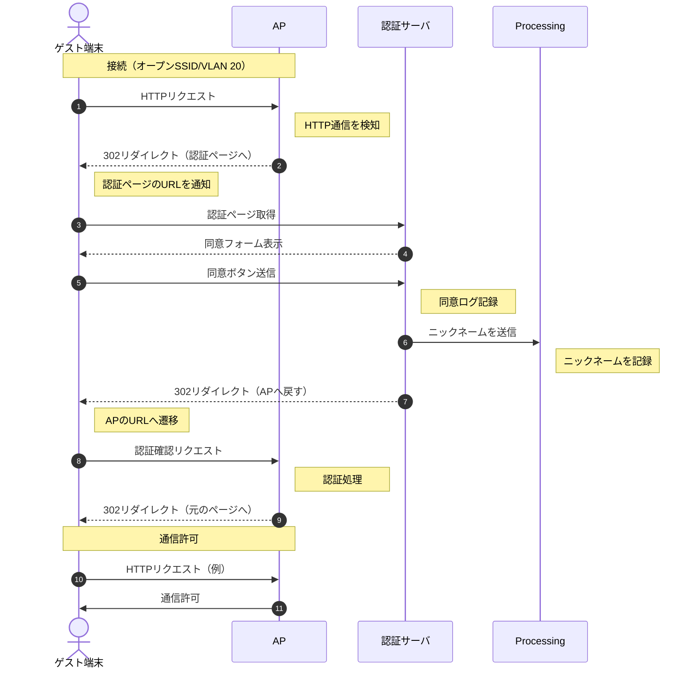
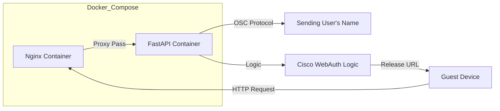

# System Context

データの流れ（入力→解析→描画）と、ユーザー認証（介入）の流れ。

## Analyzer (Python)

### Pipeline Design

* pysharkの`LiveCapture()`を用い、リングバッファー構造ではなくストリーム処理`sniff_continuously`でパケットを取得。

* Layer Strategy
    1. Link Layer(Ethernet)
    2. Network Layer(IP)
    3. Transport Layer(TCP/UDP)
    4. Application Layer(DNS/TLS/HTTP)
    上記の順にOSI参照モデルに基づき責任連鎖（Chain of Responsibility）パターンで処理を委譲。

* Optimization
    `AttributeError`を防ぐため`get_nested_attr()` で安全に属性へアクセス。

## Visualizer (Java/Processing)

### Particle System

* Design Pattern
    Boidsアルゴリズム（群れシミュレーション）を応用している。

* Optimization
    描画負荷軽減のため、画面外に出たパーティクルは逆順ループで即時削除。

* ArrayListによる動的なオブジェクト管理。

* Rendering
    加算合成 (ADD blend mode) を使用し、トラフィックの集中を「光の強さ」として表現。

## Captive Server

実験の同意取得およびネットワーク認証を行うローカルサーバー。

* Tech Stack
  * Infrastructure: Docker / Docker Compose
  * Web Server: Nginx (Reverse Proxy & Static Files)
  * App Server: Python (FastAPI) + uv

### Authentication Flow (Cisco External WebAuth)

1. Redirection
    ゲスト端末がWebアクセスを試みると、`Cisco AP`がローカルの`Captive Server`へリダイレクト。

2. Consent
    ユーザーは利用規約（実験同意書）を確認し、「同意する」ボタンを押下。

3. Submission
    FastAPIがPOSTリクエストを受け取り、ログ（同意日時・ニックネーム・MACアドレス）を記録。

4. Authorization
    サーバーが`Cisco AP`に対して「このMACアドレスを許可せよ」というリダイレクトURL（switch_url）を生成し、クライアントに返す。

5. Connection
    ユーザーはインターネット接続が許可される。

### External Web Authentication Protocol

Cisco Mobility Express (WLC) からのリダイレクト仕様。

* Redirection URL Format
    ゲストが未認証状態でWebアクセスすると、以下のパラメーターと共にCaptive Portalへリダイレクトされる。
    `http://<Portal_IP>/login.html?switch_url=<WLC_URL>&ap_mac=<AP_MAC>&client_mac=<Client_MAC>&wlan=<SSID_Name>`

* Auth Submission
    同意後、システムはWLCに対して以下の認証リクエストをPOSTします。
    * Target: `http://<192.0.2.1>/login.html` (WLC Virtual IP)
    * Action: `buttonClicked=4` (Access Granted)

## Communication

### OSC 通信仕様

* ポート: 12345

#### マシン 1 → マシン 2

* アドレス: `/packet/{protocol_name}`
* 引数:
    1. `string` 送信元IP
    2. `string` 宛先IP
    3. `int` パケット長
    4. `float` タイムスタンプ

例としてAnalyzerからVisualizerへは以下のフォーマットで送信されます

* `/packet/http`: `[src_ip, dst_ip, size, timestamp]`
* `/packet/tls`: `[src_ip, dst_ip, size, timestamp]`

#### マシン 3 → マシン 2

* アドレス: `/update/node/name`
* 引数:
    1. `string` 紐付け対象のIPアドレス
    2. `string` 表示したい名前（文字列）
