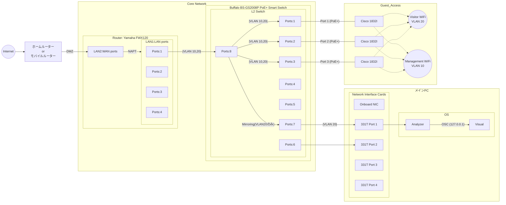

# Infrastructure

## Topology

## Hardware Selection

* Router (Yamaha FWX120)
  * コンシューマー機では耐えられないNATセッション数を捌くため。
  * ステートフルインスペクションとポリシーフィルターで柔軟な通信制御を行うため。

* AP (Cisco Aironet/Catalyst)
  * 干渉対策と接続安定性のため。

* Switch (Buffalo BS-GS2008P PoE+ Smart Switch)
  * PoE+給電対応でAPを動作させるため。
  * VLAN対応でセグメント分離を行うため。
  * ミラーポート機能を用いてパケットキャプチャーをするため。
  * Web GUIで簡単に設定できるため。

## Network Settings

### VLANの割当

| ゾーン      | VLAN ID | ネットワーク     | 役割                           |
| ----------- | ------- | ---------------- | ------------------------------ |
| DMZ（WAN）  | -       | DHCP             | ホームルーター<-->FWX120       |
| Native VLAN | VLAN1   | 192.168.xxx.0/24 | FWX120やBS-GS2008Pなどの管理用 |
| Trust       | VLAN10  | 10.0.10.0/24     | 管理用・CiscoAP                |
| Guest       | VLAN20  | 10.0.20.0/24     | CiscoAP・ゲスト端末            |

### 通信制御の全体コンセプト（マトリクス図）

セグメント間の通信を「デフォルトは遮断、必要なものだけ許可」というコンセプトで設計。
フィルターではなくポリシーフィルターで設定。

| 送信元 / 宛先      | Trust (10) | Guest (20) | Internet (WAN) |
| :----------------- | :--------- | :--------- | :------------- |
| **Trust (管理)**   | 許可       | 許可       | 許可           |
| **Guest (ゲスト)** | 遮断       | 許可       | 許可           |

### 通信ポリシー (L3/L4 Filter)

1. Guest(VLAN20) -> DNS(TCP/53,UDP/53), Internet(TCP/80,443), Mail： 許可
2. Trust(VLAN10) -> All： 許可

### 監視設計

* ミラーポート設定
  * Buffalo BS-GS2008PのPort8のトラフィックをPort7にミラーリング
  * メインPCのNICをPort7に接続
* パケットキャプチャ設定
  * PCのNICはIPアドレスを設定しない（パケット受信用のみ）
  * ミラーされたパケットはVLAN20タグ付きで届くため、OS側でVLANタグを剥がす設定を行う
  * Analyzerは剥がされたパケットを受信
  * 接続されたPCのNICを「プロミスキャスモード（`promisc`）」に設定

### Wi-Fiについて

#### SSID構成

| SSID名              | 紐付けVLAN | 認証方式   | 備考             |
| ------------------- | ---------- | ---------- | ---------------- |
| EthernetRiver-Admin | VLAN 10    | WPA2/3-PSK | 管理者・設備用。 |
| EthernetRiver-Guest | VLAN 20    | WPA2/3-PSK | 展示端末用。     |

#### 詳細仕様

* アイソレーション: 有効（P2P Blocking）。ゲスト向けWi-Fi内クライアント間通信を禁止。
* VLAN20のDHCP: DNSサーバーとして8.8.8.8を明示的に指定する。
