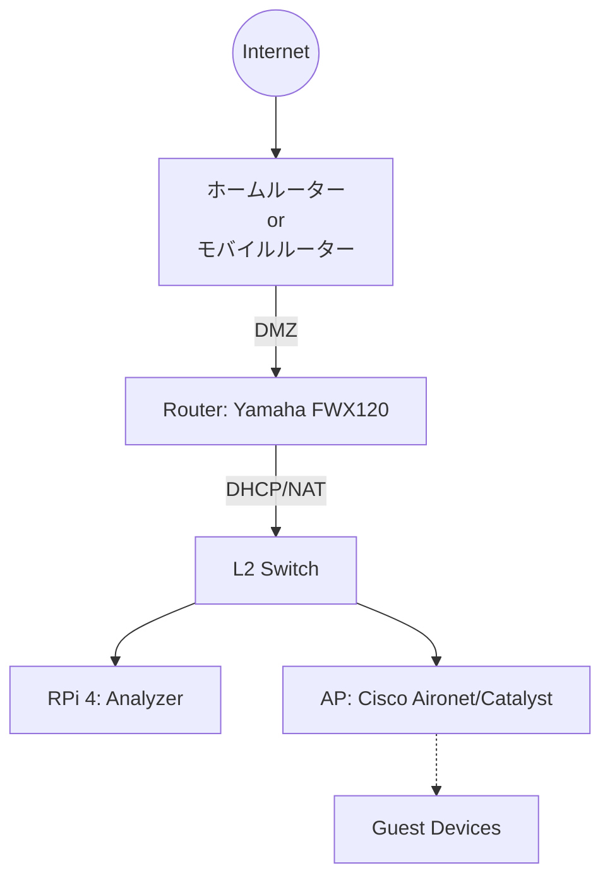

# Infrastructure

## Topology

## Hardware Selection

* Router (Yamaha FWX120)
  * コンシューマー機では耐えられないNATセッション数を捌くため。
  * ミラーポートを用いてパケットキャプチャーをするため。

* AP (Cisco Aironet/Catalyst)
  * 干渉対策と接続安定性のため。
  * Captive Portalを用いた情報収集と個人情報収集に同意してもらうため。

## Network Settings
