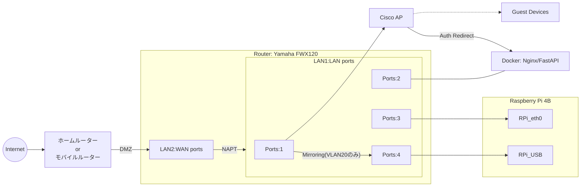

# Infrastructure

## Topology

## Hardware Selection

* Router (Yamaha FWX120)
  * コンシューマー機では耐えられないNATセッション数を捌くため。
  * ミラーポートを用いてパケットキャプチャーをするため。

* AP (Cisco Aironet/Catalyst)
  * 干渉対策と接続安定性のため。
  * Captive Portalを用いた情報収集と個人情報収集に同意してもらうため。

## Network Settings

### VLANの割当

| ゾーン     | VLAN ID | ネットワーク | 役割                     |
| ---------- | ------- | ------------ | ------------------------ |
| DMZ（WAN） | -       | DHCP         | ホームルーター<-->FWX120 |
| Trust      | VLAN10  | 10.0.10.0/24 | 管理用・RPi4・CiscoAP    |
| Guest      | VLAN20  | 10.0.20.0/24 | CiscoAP・ゲスト端末      |
| Service    | VLAN30  | 10.0.30.0/24 | Captive Portal Server    |

### FWX120のVLAN設定

| ポート | 許可するVLAN |
| ------ | ------------ |
| Port1  | VLAN10,20    |
| Port2  | VLAN30       |
| Port3  | VLAN10       |
| Port4  | VLAN10,20    |

### 通信制御の全体コンセプト（マトリクス図）

セグメント間の通信を「デフォルトは遮断、必要なものだけ許可」というコンセプトで設計。
フィルターではなくポリシーフィルターで設定。
Service(30) → Guest(20)の戻りのパケットはステートフルインスペクションによって動的に許可

| 送信元 / 宛先          | Trust (10)      | Guest (20) | Service (30)    | Internet (WAN) |
| :--------------------- | :-------------- | :--------- | :-------------- | :------------- |
| **Trust (管理)**       | 許可            | 許可       | 許可            | 許可           |
| **Guest (ゲスト)**     | 遮断            | 許可       | 条件付許可 (※1) | 認証後許可     |
| **Service (ポータル)** | 条件付許可 (※2) | 遮断       | 許可            | 許可           |

※1 FWX120は「VLAN 20 → VLAN 30の80/443ポート」だけを特別に許可
※2 FWX120は「VLAN 30 → VLAN 10の12345ポート」だけを特別に許可（OSCのため）

### 通信ポリシー (L3/L4 Filter)

1. Guest(VLAN20) -> Captive Portal Server(VLAN30)：（TCP/80,443）許可
2. Guest(VLAN20) -> DNS(TCP/53,UDP/53)： 許可
3. Service(VLAN30) -> Trust(VLAN10)： OSC(TCP/12345,UDP/12345)許可
4. Trust(VLAN10) -> All： 許可

### 認証方式

* Cisco Mobility ExpressのExternal WebAuthを使用。
* FastAPIでの認証成功後、APの承認URLへリダイレクト。

### 監視設計

* VLAN20のTX/RXトラフィックをLAN1 Port4へミラー。
* Port4はIPアドレスも持たない。
* RPi側はPysharkで解析。
* RPiのUSB-Ethernetアダプターを「プロミスキャスモード（`promisc`）」に設定

### Wi-Fiについて

#### SSID構成

| SSID名       | 紐付けVLAN | 認証方式              | 備考                                       |
| ------------ | ---------- | --------------------- | ------------------------------------------ |
| {Name}_Admin | VLAN 10    | WPA2/3-PSK            | 管理者・設備用。Captive Portalなし。       |
| {Name}_Guest | VLAN 20    | Open/External WebAuth | ゲスト用。接続後、VLAN30のポータルへ誘導。 |

#### 詳細仕様

* アイソレーション: 有効（P2P Blocking）。SSID内クライアント間通信を禁止。
* VLAN20のDHCP: DNSサーバーとして8.8.8.8を明示的に指定する。
* Pre-Auth ACL（認証前許可リスト）
  * 10.0.30.0/24へのHTTP/HTTPS(TCP/80,443)
  * インターネット側へのDNS(UDP/53,TCP/53)

* ステルス設定
  * Admin用: 攻撃リスクを減らすためステルス（Non-broadcast）にする。
  * Guest用: 接続性を優先し、通常通りブロードキャストする。
